# Testing framework for bempp-rsrs

This is a testing framework that interfaces Structured Operators from Python and performs RSRS on them through bempp-rsrs


## Installation

This repository uses Git submodules for the exact `exafmm-t`, `bempp-cl`, and `kifmm-for-rsrs` revisions it expects. The checkouts live in `external/exafmm-t`, `external/bempp-cl`, and `external/kifmm-for-rsrs`, and both the Docker workflow and the local workflow install those local copies rather than cloning ExaFMM or KiFMM on demand or pulling `bempp-cl` from PyPI.

Before using either installation route, make sure the submodules are present:

```bash
git submodule update --init --recursive
```

### Option 1: Docker / Docker Compose

This is the easiest route, especially on Apple Silicon, because `compose.yaml` already requests a `linux/amd64` container.

Build and start the development container with Docker Compose:

```bash
docker compose build
docker compose run --rm dev
```

If you prefer plain Docker commands, you can also use:

```bash
docker build -t rsrs-exps .
docker run --rm -it rsrs-exps
```

On container startup, `scripts/setup_deps.sh` will:

1. Create `.venv` inside `/workspace`.
2. Stage `exafmm-t` from the submodule checkout at `/workspace/external/exafmm-t`, then build and install it.
3. Install `bempp-cl` from the submodule checkout at `/workspace/external/bempp-cl` in editable mode.
4. Build and install `kifmm-for-rsrs` from `/workspace/external/kifmm-for-rsrs` with `maturin develop --release` into that same `.venv`.
5. Export `BEMPP_KIFMM_ROOT` (and `BEMPP_KIFMM_LIBRARY` when available) so `bempp-cl` can find the KiFMM shared library.
6. Build this Rust project with `cargo build` unless `BUILD_RUST_PROJECT=0` is set for a lightweight smoke run.

If you want to force a completely clean reinstall of the cached Docker dependencies, remove the named volumes first:

```bash
docker compose down -v
```

### Option 2: Local install without Docker

The local workflow is now scripted. On Ubuntu 22.04 or another apt-based Linux environment, you can install everything with:

```bash
bash scripts/setup_local.sh --install-system-packages --install-rust
```

If the system packages and Rust toolchain are already present, the shorter form is enough:

```bash
bash scripts/setup_local.sh
```

By default, `scripts/setup_local.sh` will:

1. Initialize the `external/exafmm-t`, `external/bempp-cl`, and `external/kifmm-for-rsrs` submodules.
2. Create `.venv` in the project root.
3. On supported Linux hosts, build `exafmm-t` from the local submodule checkout and install it into `.deps/exafmm-prefix` instead of `/usr/local`.
4. Install `h5py`, editable `bempp-cl`, and the `kifmm-for-rsrs` Python bindings into that same `.venv`, plus the ExaFMM Python bindings on supported Linux hosts.
5. Export the KiFMM discovery variables used by `bempp-cl`.
6. Write `.rsrs-env.sh`, which re-exports the local KiFMM and ExaFMM paths for later shells.
7. Run `cargo build` unless `--skip-rust-build` is passed.

After the setup finishes, activate the environment with:

```bash
source .venv/bin/activate
source .rsrs-env.sh
```

The generated `.rsrs-env.sh` sets `BEMPP_KIFMM_ROOT`, `BEMPP_KIFMM_LIBRARY` when available, and, on supported Linux hosts, the local ExaFMM include/library paths. That keeps the non-Docker workflow self-contained and avoids requiring a system-wide `make install`.

If you are on a non-apt Linux distribution, install the equivalent system packages yourself and then run:

```bash
bash scripts/setup_local.sh
```

The apt-based package set used by the helper script is:

```bash
ca-certificates curl git pkg-config build-essential cmake clang lld \
gfortran libssl-dev openmpi-bin libopenmpi-dev libhdf5-dev \
libopenblas-dev liblapack-dev libfftw3-dev python3.10 python3.10-dev \
python3.10-venv python3-pip patchelf libfontconfig1-dev \
libfreetype6-dev gmsh
```

If you already have Python but want to override which interpreter creates the virtual environment, use:

```bash
bash scripts/setup_local.sh --python python3.11
```

### Notes

- The `external/exafmm-t`, `external/bempp-cl`, and `external/kifmm-for-rsrs` submodules are the ones this project is expected to use. If you clone the repository without submodules, run `git submodule update --init --recursive` before starting Docker or the local setup.
- `bempp-cl` is installed in editable mode, and the setup script will rebuild KiFMM when it detects newer source files in the submodule checkout.
- `bempp-cl` does not import `kifmm_py` to discover KiFMM. It looks for the KiFMM shared library through `BEMPP_KIFMM_ROOT` or `BEMPP_KIFMM_LIBRARY`, which is why the setup exports those variables after building the KiFMM submodule checkout.
- ExaFMM does not work on macOS hosts. On Macs, `bash scripts/setup_local.sh` skips the ExaFMM build automatically, so local installs should use KiFMM or dense assembly. If you need ExaFMM on a Mac, use Docker because the Compose service already targets `linux/amd64`.
- If `gmsh` is missing outside Docker, make sure the `gmsh` executable is installed and available on `PATH`.
## Example of usage:

This is a compilation of examples of uses of RSRS


```python
from rsrs_config import RSRSBenchmarkConfig
print(RSRSBenchmarkConfig.__init__.__doc__)
```

    
            Initialize RSRS Benchmark Configuration.
    
            Parameters
            ----------
            operator_type : int, optional
                Index selecting the structured operator type to use.
                Options include:
                0: BasicStructuredOperator (default)
                1: BemppClLaplaceSingleLayer
                2: BemppClHelmholtzSingleLayer
                3: KiFMMLaplaceOperator
                4: KiFMMHelmholtzOperator
                5: BemppRsLaplaceOperator
                The choice affects the problem type and required parameters and more kernels can be addded in python/structured_operators.py
    
            precision : int, optional
                Index for numerical precision:
                0: Single precision (not fully enabled)
                1: Double precision (default)
    
            h : float, optional
                Characteristic meshwidth used in spatial discretization.
                For some dimension argument types, this can be computed internally from `kappa`.
                Default is 0.1.
    
            ref_level : int or None, optional
                Refinement level, used only if `dim_arg_type` corresponds to the refinement level that is 
                internally used by bempp-rs on a unit sphere ("RefinementLevelAndDepth"). Both `ref_level` and `depth`
                must be provided in this case. Default is None.
    
            depth : int or None, optional
                Depth of the fmm tree when using BemppRs operators.
                Required if `dim_arg_type` is "RefinementLevelAndDepth". Default is None.
    
            kappa : float or None, optional
                Wavenumber for oscillatory problems (Helmholtz type).
                Used to compute meshwidth if `dim_arg_type` is "Kappa".
                Required for Helmholtz operators.
                Default is None.
    
            id_tols : List[float], optional
                List of interpolation decomposition tolerances (ID tolerances).
                One test run will be executed for each tolerance value.
                Defaults to [1e-2, 1e-3, 1e-4, 1e-6, 1e-8].
    
            dim_arg_type : int, optional
                Index specifying the way spatial discretization parameters are provided:
                0: "Kappa" — compute h internally as 2π / (8 * kappa)
                1: "KappaAndMeshwidth" — provide both kappa and h explicitly
                2: "Meshwidth" — provide h only, no kappa
                3: "RefinementLevelAndDepth" — use multilevel structure parameters ref_level and depth
                Default is 2 ("Meshwidth").
    
            geometry : int, optional
                Index specifying the geometry shape used in the test.
                Options include:
                0: SphereSurface (default)
                1: CubeSurface
                2: CylinderSurface
                3: EllipsoidSurface
                Note: For Bempp-rs operators, only SphereSurface is supported.
    
            solve_tol : float, optional
                Tolerance for the GMRES linear solver if `solve` is True.
                Default is 1e-5.
    
            solve : bool, optional
                Whether to solve the linear system Ax = b using GMRES.
                Default is True.
    
            plot : bool, optional
                Whether to generate a pie chart showing execution time breakdown after tests.
                Default is True.
    
            dense_errors : bool, optional
                If True, compute RSRS errors on the dense matrix form of blocks.
                This is memory and time intensive; recommended only for small problems.
                Default is False.
    
            results_output : int, optional
                Index controlling what results are output from the test:
                0: "All" — output all available information (default)
                1: "Rank" — output compression ranks and errors
                2: "Time" — output timing information and errors
    
            null_method : int, optional
                Index selecting method to nullify matrices:
                0: "Projection" (fastest, using I - Ω⁺Ω)
                1: "Svd"
                2: "Qr"
    
            block_extraction_method : int, optional
                Index selecting solver for least squares problems during block extraction:
                0: "LuLstSq" (solves normal equations with LU, fastest)
                1: "Svd"
    
            pivot_method : int, optional
                Index selecting pivot strategy for LU or matrix inversion:
                0: "Lu"
                1: "DirectInversion"
    
            rank_picking : int, optional
                Index selecting fixed-rank merging strategy when combining blocks:
                0: "Min" — use smallest skeleton size
                1: "Max" — use largest skeleton size
                2: "Avg" — use average skeleton size
                3: "Mid" — use median skeleton size
                4: "DoubleMin" — use double the minimum rank of previous level
                5: "Tol" — use the defined tolerance as rank
    
            Raises
            ------
            ValueError
                If required parameters for certain configurations are missing or inconsistent, such as:
                - `ref_level` or `depth` missing when `dim_arg_type` is "RefinementLevelAndDepth".
                - `kappa` missing when required for Helmholtz operators.
                - Invalid geometry for Bempp-rs operators.
                - `dense_errors` enabled for Bempp-rs operator which has no dense form.
    
            Notes
            -----
            - The parameter indices correspond to internal lists of options documented above.
            - For most operators, `kappa` is required if `dim_arg_type` is "Kappa" or "KappaAndMeshwidth".
            - This class constructs shell script commands to run benchmarks with the configured parameters.
            


```python
## Generate the test case either to run the test or retrieve results
## recommendations: if operator_type = 5, and if ref_level = 8, pick depth = 4 (this is a problem of around 500k dofs)
## if ref_level = 9, pick depth = 5 (this is a problem of around 2MM dofs)
config = RSRSBenchmarkConfig(operator_type=5, dim_arg_type=3, ref_level=5, depth=2)
```


```python
## Generate the shell script (disable it unless you want to run the test)
config.generate_bash_script("run_test.sh")
```


```python
## Running test in Rust

#!./run_test.sh
```


```python
print("This problem has " + str(config.get_degrees_of_freedom()) + " degrees of freedom")
```

    This problem has 8192 degrees of freedom


```python
print(config.plot_errors_vs_tolerance.__doc__)
```

    
            Plot a specified error metric vs tolerance.
    
            Parameters
            ----------
            metric_index : int
                The index of the error metric to plot on the y-axis. Must be one of:
                1 - 'norm_2_error'
                2 - 'norm_2_error_inv'
                3 - 'app_condition_number'
                4 - 'tot_num_samples'
                5 - 'residual_size'
            logx : bool
                If True, use logarithmic scale for the x-axis (tolerance).
            logy : bool
                If True, use logarithmic scale for the y-axis (metric).
    
            Raises
            ------
            ValueError
                If `metric_index` is not in the range 1 to 5.
            


```python
config.plot_errors_vs_tolerance(1)
```


    
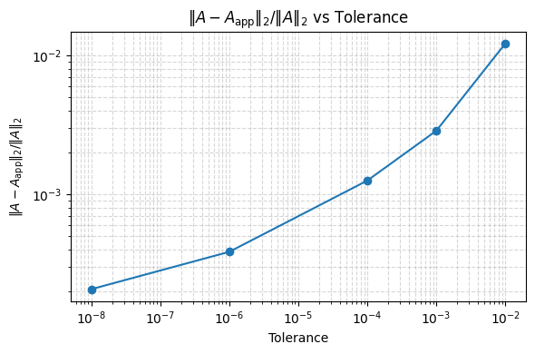
    


```python
config.plot_errors_vs_tolerance(2)
```


    
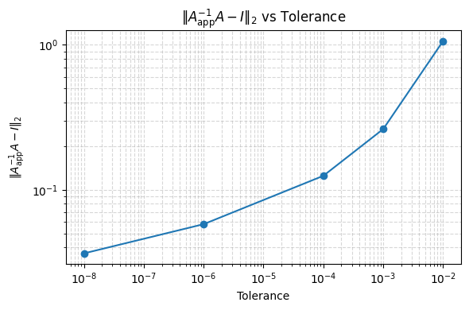
    


```python
config.plot_errors_vs_tolerance(3, logy=False)
```


    
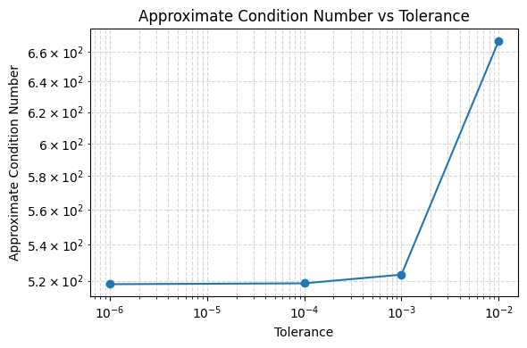
    


```python
config.plot_errors_vs_tolerance(4, False)
```


    
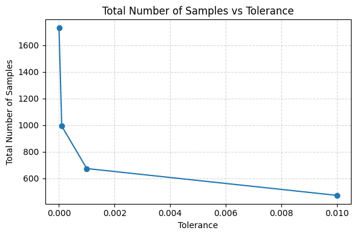
    


```python
config.plot_errors_vs_tolerance(5, False)
```


    
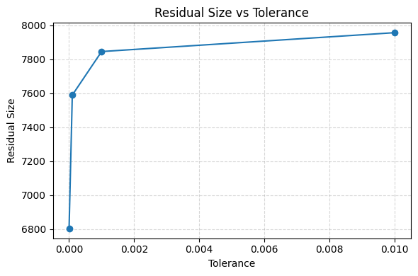
    


```python
config.plot_gmres_residuals()
```


    
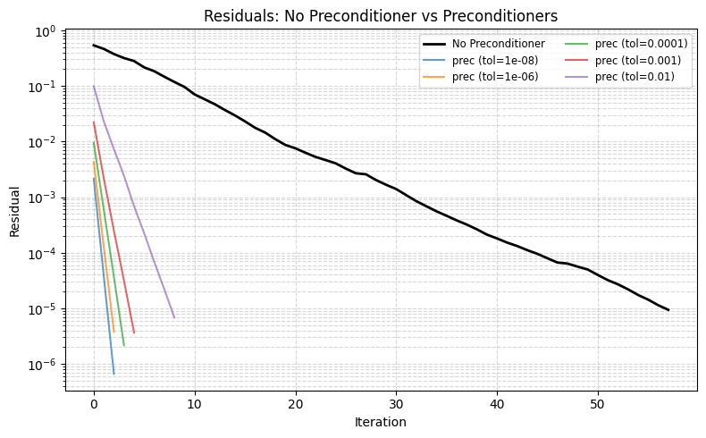
    


```python
config.plot_residual_convergence()
```


    
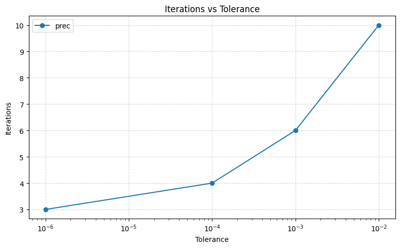
    


```python
print(config.plot_total_elapsed_time_vs_tolerance.__doc__)
```

    
            Plot total elapsed time without sampling vs tolerance (in seconds).
    
            Parameters
            ----------
            logx : bool, optional
                If True, use log scale on the x-axis (tolerance).
            logy : bool, optional
                If True, use log scale on the y-axis (time).
            


```python
config.plot_total_elapsed_time_vs_tolerance(logy=False)
```


    
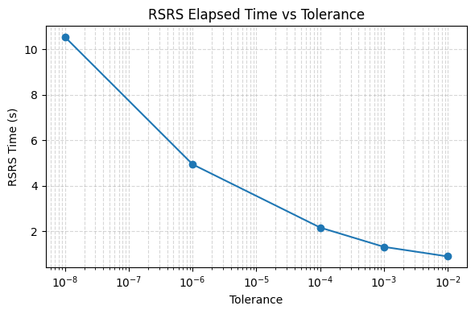
    


```python
print(config.plot_time_breakdown_piecharts.__doc__)
```

    
            Plot a pie chart of time breakdown for each tolerance.
    
            Parameters
            ----------
            max_charts : int or None
                Maximum number of pie charts to display. If None, shows all.
            


```python
config.plot_time_breakdown_piecharts()
```


    
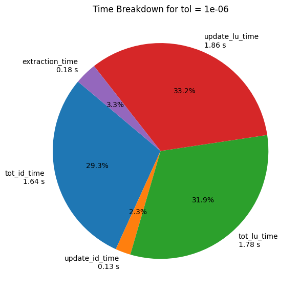
    


    
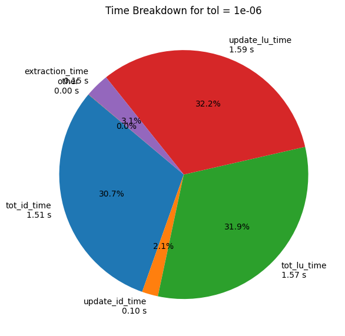
    


    
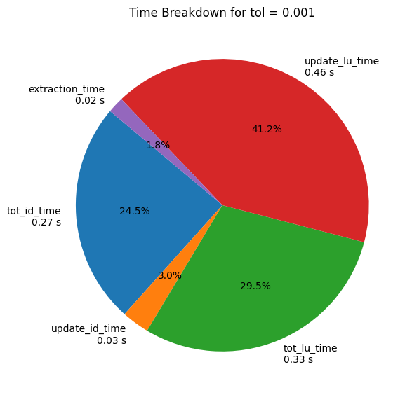
    


    
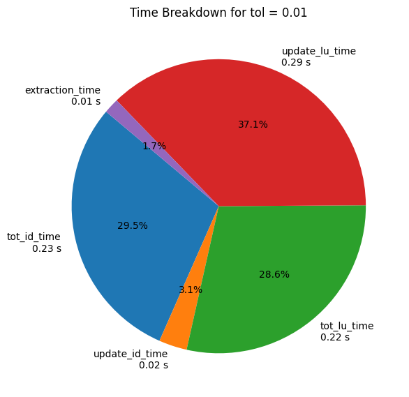
    


    
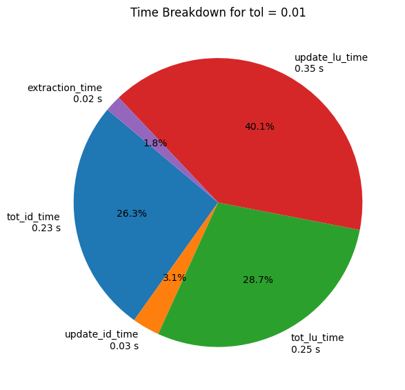
    
